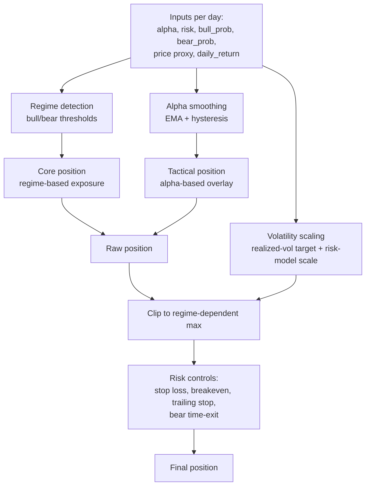
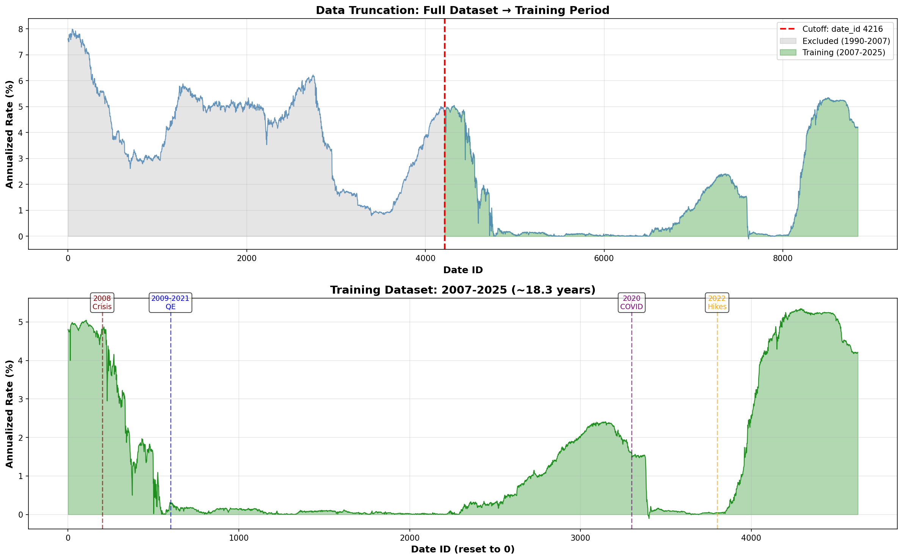
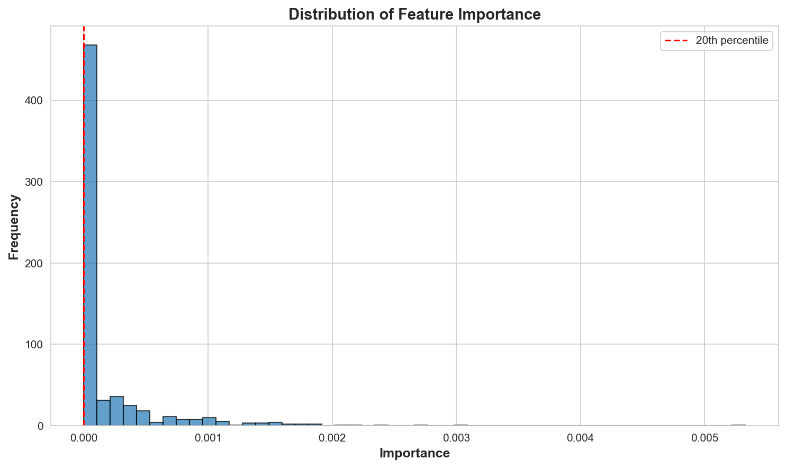
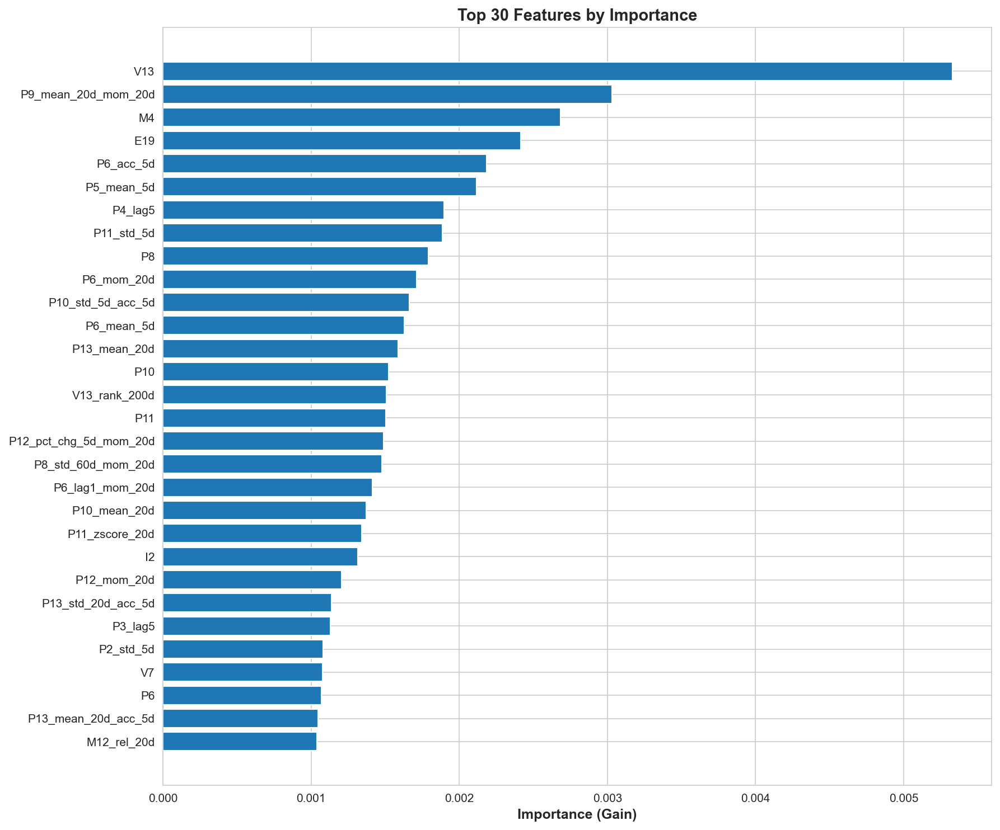

# Hull Tactical: Alpha Transformer + Tree Models + Trading Strategy

This repository contains an end-to-end research and modeling pipeline for a tactical market prediction / allocation task.

## Competition Raw data

The starting point is the competition’s raw daily panel (one row per trading day), typically stored under:

- `data/raw/train.csv`
- `data/raw/test.csv` (a demo test set with only 10 rows)

Key columns follow a simple convention:

- **Time index**: `date_id` (trading day)
- **Targets**:
  - `forward_returns` (forward return)
  - `market_forward_excess_returns` (forward excess return vs benchmark)
- **Auxiliary series**: `risk_free_rate`
- **Features**: a set of factor-style columns (the original dataset has 89 base factors). In this repo you will see factor groups commonly prefixed by:
  - `D*`, `E*`, `I*`, `M*`, `P*`, `S*`, `V*`

## Competition Requirements

This project started from a practical observation: the competition metric is not a pure prediction score but a variant of Sharpe Ratio. It rewards **outperformance** but explicitly penalizes strategies that run much higher volatility than the market. That constraint naturally pushes the solution toward a high importance of risk management.

## Backtest Result of the Final Submission

See details in `tree+transformer_5.ipynb`


## Iteration history

The final system is the result of several iterations. The main driver behind the changes was improving **IC score and signal stability**, then turning those signals into a **robust, risk-aware position**.

- **Version 0** — “Predict position directly” (2007–2024, linear + tree ensemble)

  - Trained linear models and tree models on 2007–2024, ensembled them, and predicted the position directly.
  - Result: IC was mediocre and the signal was not stable enough to support consistent strategy improvements.
- **Version 1 — Dual-window training + window fusion (2007–2024 and 2018–2024)**

  - Built two ensembles (linear + tree) separately on a long window (2007–2024) and a short window (2018–2024). This is because several factors were not consistently available until ~2018, and I wanted to place more weight on learning the style of the “modern” market. Both windows use time-series validation.
  - Fused the two outputs with a higher weight on the short window; fusion weights are learned on a split validation set (e.g. 2023).
  - Result: IC started to improve and the signals became more usable.
- **Version 2 — Decompose signals into Alpha / Risk / Regime (2 windows × 3 signals = 6  LightGBM sub-models) + strategy layer**

  - Replaced “one model does everything” with three dedicated signals:
    - **Alpha**: expected return signal
    - **Risk**: volatility / uncertainty proxy
    - **Regime**: market state classification (bull/swing/bear)
  - Trained each signal on both long (2007–2024) and short (2018–2024) windows (3 × 2 = 6 models), then performed time-based fusion.
  - Introduced a strategy layer that converts the three signals into positions.
  - Result: IC improved substantially; backtests started to beat the benchmark for the first time. However, the Alpha signal was still noisy and often pointed to “wrong entry timing”, leading to frequent tactical mistakes.
- **Version 3 — Upgrade Alpha to Transformer (Risk/Regime remain tree models)**

  - Switched Alpha from a point-in-time tree model to a Transformer to better exploit sequential structure (rolling feature windows) and learn a smoother, context-aware signal.
  - Result: training was unstable on the 2018–2024 window and the Alpha signal did not generalize well.
- **Version 4 — Transformer Alpha on 2007–2025 + Sigmoid time-decay training**

  - Stopped doing long/short fusion for the Transformer; trained a single Alpha Transformer on 2007–2025.
  - Added **Sigmoid time-decay weighting** so that newer regimes contribute more to training, without fully discarding earlier regimes.
  - Result: IC converged to a high, stable score and the alpha signal became stable enough to support systematic strategy iteration.
- **Version 5 — First Submission: Strategy upgrade (aggressive) around the stable signal stack**

  - Kept the hybrid modeling stack:
    - **Alpha**: Transformer
    - **Risk/Regime**: LightGBM (with long/short horizon variants where applicable)
  - Major strategy design upgrades (implemented as `TrendFollowingStrategy`):
    - **Core + Tactical two-layer position**:
      - *Core* exposure driven by regime probabilities (bull/swing/bear).
      - *Tactical* overlay driven by the smoothed alpha signal.
    - **Alpha hysteresis + EMA smoothing** to reduce over-trading:
      - Open only when alpha crosses an upper threshold.
      - Exit only when alpha falls below a lower threshold for `EXIT_CONFIRM_DAYS`.
    - **Volatility-aware scaling** (two mechanisms combined):
      - Realized-vol targeting from recent strategy returns.
      - Risk-model scaling (interpreting risk output roughly as `log(vol)` and scaling toward a target annualized vol).
    - **Risk controls**:
      - Stop-loss, breakeven tightening, and ATR-like trailing stop based on rolling volatility.
      - Regime-aware max exposure and time-based exits in non-bull regimes.
  - This version is intentionally more aggressive (higher exposure cap, more active tactical overlay) to maximize upside when the signal is correct.
- **Version 6 — Second Submission: conservative, risk-sensitive variant**

  - The competition allows two submissions, so a second strategy variant is built with higher risk sensitivity.
  - Same signal stack, but tighter risk controls / lower exposure caps to hedge the scenario of a persistent bear market (e.g., 2026H1).

The main artifact of interest is the notebook:

- `notebooks/tree+transformer_5.ipynb`

It trains:

- An **Alpha Transformer** (PyTorch) to predict a short-horizon alpha signal.
- Two **LightGBM** models for **risk** and **regime** estimation (long-horizon and short-horizon variants).
- A **rule-based trading strategy** (`TrendFollowingStrategy`) that converts model outputs into daily positions using:
  - Regime-based core exposure
  - Alpha-based tactical overlay
  - Volatility-aware scaling
  - Stop-loss / breakeven / trailing stop risk controls

The notebook also produces model files and JSON configs that are intended to be reused for Kaggle submission/inference.

## System Architecture (model layer + strategy layer)

### End-to-end flow

```mermaid
flowchart TB
  A[Raw daily features] --> B[Feature engineering<br/>lags, rolling stats, momentum, z-scores, ranks]
  B --> C1[Alpha model<br/>Transformer on sequences]
  B --> C2[Risk model<br/>LightGBM regression]
  B --> C3[Regime model<br/>LightGBM classification]

  C2 --> D[Long/short horizon fusion<br/>W_RISK_*, W_REGIME_*]
  C3 --> D
  C1 --> E[Strategy layer<br/>TrendFollowingStrategy]
  D --> E

  E --> F[Daily position<br/>allocation in [0, 2]]
```

### Strategy Internals (high level)



## Repository layout

- `notebooks/`
  - `eda.ipynb`: data overview, missingness, target distribution, correlation/feature group inspection.
  - `data_cleaning.ipynb`: data truncation + dataset preparation for the two-window modeling setup.
  - `feature_engineering.ipynb`: feature generation for tree models with strict leakage control (lags, rolling stats, z-scores, rolling ranks, selected interactions).
  - `transformer_feature_engineering.ipynb`: builds Transformer-ready sequential features (Level/Trend/Volatility transforms), selects top features for the Alpha Transformer.
  - `tree+transformer_5.ipynb`: primary training + evaluation notebook.
  - `tree+transformer_6.ipynb`: later iteration with config export fixes.
- `data/`
  - `transformer/`: transformer train/validation CSVs.
  - `intermediate/`: intermediate engineered datasets.
- `models/`
  - Saved model weights and JSON configs (see “Artifacts”).
- `analysis/`
  - Plots and feature importance artifacts used in this README.
- `docs/`
  - Background notes, project planning, and competition description.
- `submission/`
  - Kaggle submission scaffolding.

---

## More Details

## Key EDA Findings

#### Why I didn't train primarily on 1990–2006

The raw dataset spans a much longer period, but I intentionally avoid making 1990–2006 the dominant training signal. Two issues show up clearly when you visualize missingness over the full history.

- **Many factors were not formed in the early period**

  - In 1990–2006 there are large missing blocks across multiple feature groups.
  - Even when a column exists, its economic meaning and construction may differ across decades.
  - If we train heavily on this period, the model can end up learning the *pattern of missingness* and proxy artifacts, which does not generalize to the modern regime.
- **Market structure changed materially before 2007 (quant participation / microstructure)**

  - Prior to ~2007, systematic/quant trading was much less dominant; liquidity, transaction costs, and the speed of arbitrage were different.
  - As quant adoption accelerated, many simple edges decayed and the mapping from features to returns shifted.
  - Treating early history as equally relevant can cause negative transfer: better fit to the past but worse robustness for the current regime.

This is why the pipeline focuses on **2007–2025** (broad regime coverage) and **2018–2025** (modern alignment) to keep useful historical information while emphasizing recent regimes.




#### Feature engineering highlights

Starting from the original feature set, feature engineering focused on generating structured, model-friendly signals:

- **Lag features** (e.g., `lag1`, `lag5`, `lag20`)
- **Rolling statistics** (mean/std over 5/20/60 days)
- **Momentum / ROC features**
- **Z-score normalization features** over rolling windows
- **Rolling percentile ranks** (e.g., 60d/200d rank)
- **Acceleration** features (changes of changes)
- **Composites** (stacked transformations, e.g., `mean_20d` then `mom_20d`)

The intent is to expose multiple “views” of the same underlying drivers (trend, mean-reversion, volatility regime, sentiment/macro proxies), while keeping them compatible with both tree models and sequential deep models.

### Feature importance snapshots






## Data Engineering

The project uses two different “views” of the same raw data:

- A **tree-friendly view** (more handcrafted stationary features; strict leakage control).
- A **Transformer-friendly view** (sequence features designed for learning smooth context).

Below is the concrete data-engineering pipeline and the artifacts it produces.

### 1) Data truncation, window split, and distribution stabilization (`data_cleaning.ipynb`)

Goal: build two consistent training windows and make feature distributions comparable across regimes.

- **Truncation**: focus on the modern training period (2007–2025) instead of the full 1990–2025 history.
- **Two-window split**:
  - **Long window (2007–2025)**: keep only the features that are fully available over this period (drop columns with missing blocks).
  - **Short window (2018–2025)**: keep a richer feature set (many columns become consistently available only in the later period).
- **Outlier handling (winsorization)**:
  - For features common to both windows, percentile bounds are estimated on the long window and applied to both windows.
  - For features unique to the short window, bounds are estimated on the short window.

Key outputs (used by downstream feature engineering and modeling):

- `data/intermediate/train_no_missing_2007_2025_cleaned.csv`
- `data/intermediate/train_2018_2025_cleaned.csv`

### 2) Tree-model feature engineering with leakage control (`feature_engineering.ipynb`)

Goal: build stationary, LightGBM-friendly features while strictly avoiding lookahead bias.

- **Leakage control principle**: any feature that uses a window statistic is computed from *historical information only* (e.g. `shift(1)` before rolling / ranking).
- **Feature families (examples)**:
  - Lags: `*_lag1`, `*_lag5`, `*_lag20`
  - Rolling stats: `*_mean_{5/20/60}d`, `*_std_{5/20/60}d`
  - Rolling z-scores: `*_zscore_20d`
  - Rolling percentile ranks: `*_rank_{60/200}d`
  - Selected interaction features (ratio/product) built from lagged inputs
- **Missingness from rolling windows**: forward-fill and median-fill to ensure the engineered matrices have no NaNs.
- **Optional global shift**: raw features are shifted by one day so that `X[t]` consistently uses information available at `t-1`.

| Feature family                        | Naming pattern (examples)                                 | Definition (high level)                                                                            | Leakage control rule                                                      |
| ------------------------------------- | --------------------------------------------------------- | -------------------------------------------------------------------------------------------------- | ------------------------------------------------------------------------- |
| Lag features                          | `X_lag1`, `X_lag5`, `X_lag20`                       | Past value of `X` at `t-1/t-5/t-20`.                                                           | Uses `shift(k)` explicitly.                                             |
| Rolling mean / std                    | `X_mean_5d`, `X_std_20d`, `X_mean_60d`              | Rolling statistics computed on history only.                                                       | Compute `X.shift(1).rolling(window)` (shift before rolling).            |
| Rolling z-score                       | `X_zscore_20d`                                          | `(X[t-1] - mean_20d) / std_20d`, where mean/std are historical.                                  | Rolling mean/std computed on `X.shift(1)` only.                         |
| Short-horizon ratio / momentum proxy  | `X_pct_chg_5d`                                          | Example: compare yesterday’s value to its recent average (e.g.`X[t-1]/mean_5d - 1`).            | Uses shifted series inside all rolling operations.                        |
| Rolling percentile ranks              | `X_rank_60d`, `X_rank_200d`                           | Percentile rank of `X[t-1]` within the historical window.                                        | Compute `X.shift(1).rolling(window).rank(pct=True)`.                    |
| Relative-to-average (volume-style)    | `M*_rel_20d`, `M*_rel_60d`                            | `M[t-1] / mean(M[t-1], window)` to normalize level effects.                                      | Always shift before rolling.                                              |
| Cross-feature ratios/products         | e.g.`M1_M6_ratio`, `E19_V10_ratio`, `S8_V9_product` | Handpicked interactions from lagged inputs (ratios/products).                                      | Every input term uses `shift(1)` so interactions are based on `t-1`.  |
| Global one-day shift for raw features | (applied in-place)                                        | Shift raw/base columns by one day so that all `X[t]` represent information available at `t-1`. | Enforces a consistent “T-1 features” convention for the entire dataset. |

Key outputs (used by the tree stack for risk/regime models and earlier iterations):

- `data/intermediate/train_no_missing_2007_2025_engineered.csv`
- `data/intermediate/train_2018_2025_engineered.csv`

### 3) Transformer feature engineering + feature selection (`transformer_feature_engineering.ipynb`)

Goal: produce a compact sequence feature set for the Alpha Transformer and export train/validation tensors in CSV form.

- **Sequence-friendly transforms per base factor**:
  - **Level**: the standardized raw value (`*_level`)
  - **Trend**: rate-of-change (`*_roc_{w}d`) and differences (`*_diff_{w}d`) for multiple windows (e.g. 5/10/20)
  - **Volatility**: rolling std (`*_std_{w}d`) for multiple windows

| Feature family | Naming pattern (examples)                     | Definition (high level)                   | Notes                                                    |
| -------------- | --------------------------------------------- | ----------------------------------------- | -------------------------------------------------------- |
| Level          | `X_level`                                   | The (scaled/standardized) factor level.   | Provides absolute state information.                     |
| Trend (ROC)    | `X_roc_5d`, `X_roc_10d`, `X_roc_20d`    | `pct_change(w)` over multiple horizons. | Captures direction and speed of change.                  |
| Trend (Diff)   | `X_diff_5d`, `X_diff_10d`, `X_diff_20d` | `diff(w)` over multiple horizons.       | Captures additive shifts (more stable for some factors). |
| Volatility     | `X_std_5d`, `X_std_10d`, `X_std_20d`    | Rolling std over multiple horizons.       | Captures factor “turbulence” / regime intensity.       |

- **Numerical hygiene**:
  - Replaces `inf` created by `pct_change`.
  - Drops the first `MAX_WINDOW` rows (rolling warmup), then forward/back fills remaining NaNs.
- **Target for selection**: constructs `target_alpha` as a short-horizon cumulative excess return (e.g. 5-day rolling sum of `market_forward_excess_returns`).
- **Top-N selection**: trains a LightGBM regressor on an 80/20 split with an embargo and selects Top-N features by importance (commonly Top 64).
- **Standardization**: fits a `StandardScaler` on the training split only and applies it to both train/val.

Key outputs (used directly by `tree+transformer_5.ipynb` / `tree+transformer_6.ipynb`):

- `data/transformer/train_transformer.csv`, `data/transformer/val_transformer.csv`
- `models/transformer_scaler.pkl`, `models/transformer_features.json`

---

## Quickstart with Prepared Datasets

### Option A: Run in Colab (recommended for training)

`tree+transformer_5.ipynb` is written in a Colab-first style and expects Google Drive mounting.

1. Open `notebooks/tree+transformer_5.ipynb` in Colab.
2. Enable GPU (Runtime → Change runtime type → GPU).
3. Mount Drive and set paths (the notebook uses:
   - `BASE_PATH = '../content/drive/MyDrive/hull'`
   - `DATA_PATH = f'{BASE_PATH}/data'`
   - `MODEL_PATH = f'{BASE_PATH}/models'`
     ).

### Option B: Run locally

For a local environment, install dependencies from `requirements.txt` (not strictly pinned), and make sure you have:

- `python>=3.10`
- `pandas`, `numpy`, `scikit-learn`
- `torch`
- `lightgbm`
- `optuna`
- `matplotlib`, `seaborn`
- `tqdm`

## Data inputs used by `tree+transformer_5.ipynb`

The notebook reads transformer-ready time-series datasets:

- `data/transformer/train_transformer.csv`
- `data/transformer/val_transformer.csv`

It also loads transformer feature metadata and scalers from the `models/` directory (see below).

## `tree+transformer_5.ipynb` — Model and Strategy (detailed)

### 1) Alpha Transformer

#### Goal

Predict `target_alpha` from a rolling window of engineered features.

#### Inputs

- A fixed feature list loaded from `models/transformer_features.json`.
- Each training sample is a sequence tensor with shape:
  - `[batch, seq_len, n_features]`

#### Where the Transformer features come from

The feature list in `models/transformer_features.json` is produced by `notebooks/transformer_feature_engineering.ipynb`.

- **Starting point**: a cleaned, no-missing dataset (`data/intermediate/train_no_missing_2007_2025_cleaned.csv`) with ~86 “base” factors.
- **Feature expansion**: for each base factor, the notebook generates three families of sequence-friendly transforms:
  - **Level**: the (standardized) raw value
  - **Trend**: rate-of-change and differences over multiple horizons (e.g. 5/10/20 days)
  - **Volatility**: rolling standard deviation over multiple horizons (e.g. 5/10/20 days)
- **Data hygiene**: replaces `inf` produced by `pct_change`, drops the first `MAX_WINDOW` rows (rolling-window warmup), and forward/back fills the remaining NaNs.
- **Target used for selection**: constructs `target_alpha` as a short-horizon cumulative excess return (e.g. 5-day rolling sum of `market_forward_excess_returns`).
- **Feature selection**: trains a LightGBM regressor on an 80/20 split with an embargo window and selects the Top-N features by importance (the main run uses Top 64).
- **Exports**:
  - The selected feature list + metadata: `models/transformer_features.json`
  - The fitted scaler (fit on train only): `models/transformer_scaler.pkl`
  - Transformer-ready datasets: `data/transformer/train_transformer.csv`, `data/transformer/val_transformer.csv`

In the notebook, key settings include:

- `SEQ_LEN = 10` (simplified from a longer default)
- `n_features = len(transformer_features)` (example run shows 64)

#### Target normalization

The notebook standardizes `target_alpha` using training-set mean/std and clips extremes:

- `target_alpha = (target_alpha - mean) / std`
- clipped to `[-CLIP_SIGMA, +CLIP_SIGMA]` (with `CLIP_SIGMA = 5.0`)

The normalization stats are saved so inference can de-normalize or be consistent.

#### Feature scaling

The input features are scaled using a `StandardScaler` loaded from:

- `models/transformer_scaler.pkl`

The dataset class then builds rolling sequences from the scaled features.

#### Time-decay weighting (Sigmoid)

Training uses a sigmoid time-decay scheme to upweight the more recent regime:

- Older regime: lower weights (e.g. around `0.3`)
- Newer regime: higher weights (up to `1.0`)

Parameters are stored in `TIME_WEIGHT_CONFIG`, e.g.:

- `breakpoint_year = 2018`
- `steepness = 2.0`
- `min_weight = 0.3`
- `max_weight = 1.0`

These weights are used during training (and intentionally disabled for validation in the notebook).

#### Model architecture

`AlphaTransformer` is a Transformer encoder regressor:

- Linear input projection: `n_features -> d_model`
- Positional encoding
- TransformerEncoder (`n_layers`, `n_heads`, feed-forward `d_ff`, GELU)
- Mean pooling over sequence dimension
- MLP head to a scalar alpha prediction

#### Training objective: IC loss

The notebook optimizes an Information Coefficient style objective:

- IC = correlation(pred, target)
- loss = `-IC`

The implementation supports per-sample weights (time-decay weighting).

#### Cross-validation

A custom time-series CV split is used with an embargo window (to reduce leakage between folds).

#### Hyperparameter search (Optuna)

A lightweight Optuna loop runs a small CV and short epoch budget to quickly select:

- `d_model`, `n_heads`, `n_layers`, `d_ff`, `dropout`
- learning rate, batch size, weight decay

The selected params are stored as `MODEL_CONFIG_OPTIMIZED`, etc.

### 2) Risk & Regime models (LightGBM)

The notebook trains separate LightGBM models for:

- **Risk** (volatility proxy / risk score)
- **Regime** (probabilities for bear/neutral/bull or a similar multi-class regime)

It saves long-horizon and short-horizon variants:

- `risk_model_long.txt`, `risk_model_short.txt`
- `regime_model_long.txt`, `regime_model_short.txt`

And a config file containing the feature lists (and optional Optuna-tuned params):

- `lgbm_config.json`

### 3) Long/short fusion logic (weights)

For validation/backtest, long-horizon and short-horizon predictions are blended in the short segment:

- Risk blend (example):

  - `risk_pred = W_RISK_LONG * risk_pred_long + (1 - W_RISK_LONG) * risk_pred_short`
- Regime blend (example):

  - `regime_proba = W_REGIME_LONG * regime_proba_long + (1 - W_REGIME_LONG) * regime_proba_short`

The short predictions are applied to the **last portion** of the validation window by aligning indices:

- `short_start_idx = n_samples - len(short_pred)`

This design lets you train a long model for stability while letting a short model adapt near the end.

### 4) Trading strategy: `TrendFollowingStrategy`

In the notebook, the strategy class is defined and used as:

- `strategy = TrendFollowingStrategy()`
- daily call:
  - `pos = strategy.update(alpha, risk, bull_prob, bear_prob, current_price, date_id, daily_return)`

There is also a compatibility alias:

- `DynamicTakeProfitStrategy = TrendFollowingStrategy`

#### State

The strategy maintains internal state such as:

- `entry_price`, `peak_price`
- `holding_days`
- `current_position`
- `core_position`, `tactical_position`
- `alpha_history`, `returns_history`
- `breakeven_activated`
- `trade_log`

#### A) Risk controls

- **Stop loss**: closes if PnL falls below `-STOP_LOSS_PCT`.
- **Breakeven**: after a profit trigger (`BREAKEVEN_TRIGGER`), the stop can tighten.
- **Trailing stop**:
  - computed from rolling volatility and an ATR-like multiplier:
    - `TRAILING_STOP_ATR_MULT` (default)
    - `TRAILING_STOP_ATR_MULT_BULL` (bull regime)

#### B) Alpha hysteresis (signal filtering)

To avoid over-trading, alpha is smoothed and uses open/close thresholds:

- EMA smoothing: `ALPHA_EMA_SPAN`
- Open threshold: `ALPHA_OPEN_THRESHOLD`
- Close threshold: `ALPHA_CLOSE_THRESHOLD`
- Exit confirmation: `EXIT_CONFIRM_DAYS`

#### C) Core + tactical positioning

The position is built as:

- **Core position**: derived from regime probabilities (bull/bear/neutral).
- **Tactical position**: derived from smoothed alpha (EMA) scaled by:
  - `TACTICAL_SCALE`, clipped by `TACTICAL_MAX`

Then:

- `raw_position = core + tactical`
- `scaled_position = raw_position * vol_scale`
- clipped to a regime-dependent max:
  - `MAX_POSITION`, `MAX_POSITION_BULL`, `MAX_POSITION_BEAR`

#### Volatility scaling

Two volatility controls interact:

1. **Realized-vol target scaling** based on strategy’s rolling `returns_history`:

   - `VOL_LOOKBACK`, `VOL_TARGET`
   - clip range: `[VOL_SCALE_MIN, VOL_SCALE_MAX]`
2. **Risk-model scaling** using the LGBM risk output:

   - interprets `risk` roughly as `log(vol)` then uses `exp(risk)`
   - scales toward `VOL_TARGET * sqrt(252)`

The final `vol_scale` is clipped to `[VOL_SCALE_MIN, VOL_SCALE_MAX]`.

#### Regime thresholds and time exits

Regime flags are computed via thresholds:

- `is_bull = bull_prob > BULL_PROB_THRESHOLD`
- `is_bear = bear_prob > BEAR_PROB_THRESHOLD`

Holding constraints:

- `MAX_HOLDING_DAYS_NEUTRAL`
- `MAX_HOLDING_DAYS_BEAR` (used for bear time-exit logic)

### 5) Backtest in the notebook

The notebook runs a validation backtest:

- uses `market_forward_excess_returns` as the return stream
- builds a price proxy via cumulative returns
- computes:
  - strategy cumulative return
  - benchmark cumulative return
  - Sharpe ratio
  - max drawdown
  - trade counts and action breakdown from `trade_log`

## Artifacts (saved outputs)

`tree+transformer_5.ipynb` writes the following files under `models/` (or `MODEL_PATH`):

### Transformer

- `alpha_transformer.pt` (PyTorch state dict)
- `scaler_alpha.pkl` (scaler used for features; naming in notebook)
- `transformer_config.json` (model config + features + time-decay config + CV metrics)

### LightGBM

- `risk_model_long.txt`, `risk_model_short.txt`
- `regime_model_long.txt`, `regime_model_short.txt`
- `lgbm_config.json` (feature lists and optional tuned params)

### Final combined config

- `final_config.json`
  - contains:
    - transformer config summary
    - time-decay config
    - fusion weights
    - strategy params (exported from `TrendFollowingStrategy`)
    - feature lists

## Notes

- The training notebooks are designed to be run with GPU resource and contain Colab-specific paths.
- The `data/` folder is managed via `.gitignore` rules (large files are ignored by default, with explicit allowlists).
